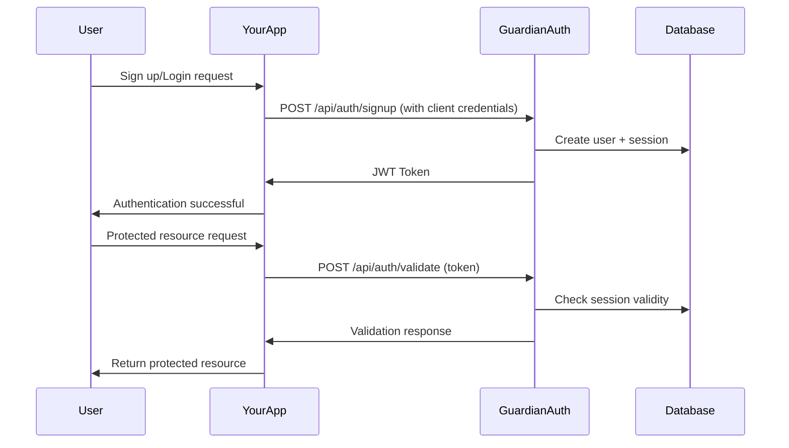

# Guardian Authentication Service - Developer Guide

**Version**: 1.0.0  
**Last Updated**: January 2025

---

## Table of Contents

1. [Quick Start Guide](#quick-start-guide)
2. [Integration Overview](#integration-overview)
3. [Getting Started](#getting-started)
4. [Authentication Flow](#authentication-flow)
5. [SDK Examples](#sdk-examples)
6. [Framework Integrations](#framework-integrations)
7. [Security Best Practices](#security-best-practices)
8. [Testing & Development](#testing--development)
9. [Production Deployment](#production-deployment)
10. [Troubleshooting](#troubleshooting)
11. [FAQ](#faq)

---

## Quick Start Guide

### 1. Register Your Application (5 minutes)

```bash
# Register your application to get client credentials
curl -X POST http://localhost:8084/api/clients/register \
  -H "Content-Type: application/json" \
  -d '{
    "name": "My Web App",
    "description": "Customer portal application", 
    "idleTimeoutMinutes": 30
  }'
```

**Response:**
```json
{
  "clientId": "ABC123",
  "clientKey": "VGhpcyBpcyBhIHNlY3VyZSBjbGllbnQga2V5",
  "name": "My Web App"
}
```

⚠️ **Important**: Save both `clientId` and `clientKey` securely. The `clientKey` is only shown once!

### 2. Implement Basic Authentication (10 minutes)

```javascript
// Simple JavaScript example
const AUTH_SERVICE_URL = 'http://localhost:8084';
const CLIENT_ID = 'ABC123';
const CLIENT_KEY = 'VGhpcyBpcyBhIHNlY3VyZSBjbGllbnQga2V5';

// User signup
async function signup(email, password, firstName, lastName) {
  const response = await fetch(`${AUTH_SERVICE_URL}/api/auth/signup`, {
    method: 'POST',
    headers: {
      'Content-Type': 'application/json',
      'X-Client-Id': CLIENT_ID,
      'X-Client-Key': CLIENT_KEY
    },
    body: JSON.stringify({ email, password, firstName, lastName })
  });
  
  if (response.ok) {
    const token = await response.text();
    localStorage.setItem('authToken', token);
    return token;
  }
  throw new Error('Signup failed');
}

// User login
async function login(email, password) {
  const response = await fetch(`${AUTH_SERVICE_URL}/api/auth/login`, {
    method: 'POST',
    headers: {
      'Content-Type': 'application/json',
      'X-Client-Id': CLIENT_ID,
      'X-Client-Key': CLIENT_KEY
    },
    body: JSON.stringify({ email, password })
  });
  
  if (response.ok) {
    const token = await response.text();
    localStorage.setItem('authToken', token);
    return token;
  }
  throw new Error('Login failed');
}

// Validate token
async function validateToken(token) {
  const response = await fetch(`${AUTH_SERVICE_URL}/api/auth/validate`, {
    method: 'POST',
    headers: {
      'Content-Type': 'application/json',
      'X-Client-Id': CLIENT_ID,
      'X-Client-Key': CLIENT_KEY
    },
    body: JSON.stringify({ token })
  });
  
  return response.ok ? await response.json() : null;
}
```

### 3. Test Your Integration (2 minutes)

```javascript
// Test the integration
(async () => {
  try {
    // Sign up a new user
    const token = await signup('test@example.com', 'SecurePass123!', 'John', 'Doe');
    console.log('✅ Signup successful:', token);
    
    // Validate the token
    const validation = await validateToken(token);
    console.log('✅ Token validation:', validation);
    
  } catch (error) {
    console.error('❌ Error:', error.message);
  }
})();
```

**That's it!** Your application is now integrated with Guardian Authentication Service.

---

## Integration Overview

### Architecture

Guardian Auth Service provides a **multi-tenant authentication system** where:

- **Multiple client applications** can use the same auth service
- **Users are isolated** by client - same email can exist across different clients
- **JWT tokens** provide stateless authentication with session tracking
- **Comprehensive audit logging** captures all authentication events

### Core Concepts

1. **Client Applications**: Your app registers to get `clientId` and `clientKey`
2. **Multi-tenancy**: Users belong to your client - complete isolation from other clients
3. **JWT Tokens**: Stateless tokens with 1-hour expiration (configurable)
4. **Rate Limiting**: 5 failed attempts per 5 minutes protection
5. **Session Management**: Automatic session tracking with idle timeouts

### Integration Points

```
┌─────────────────┐    ┌──────────────────┐    ┌─────────────────┐
│   Your App      │───▶│  Guardian Auth   │───▶│   PostgreSQL    │
│                 │    │   Service        │    │   Database      │
│ - Frontend      │    │ - Multi-tenant   │    │ - User Data     │
│ - Backend       │    │ - JWT Tokens     │    │ - Sessions      │
│ - Mobile App    │    │ - Rate Limiting  │    │ - Audit Logs    │
└─────────────────┘    └──────────────────┘    └─────────────────┘
```

---

## Getting Started

### Prerequisites

- **Guardian Auth Service** running (localhost:8084 or production URL)
- **Client credentials** (clientId and clientKey from registration)
- **HTTPS connection** (required for production)

### Environment Setup

Create environment variables for your credentials:

```bash
# .env file
GUARDIAN_AUTH_URL=http://localhost:8084
GUARDIAN_CLIENT_ID=your_client_id
GUARDIAN_CLIENT_KEY=your_client_key
```

### Installation

Choose your preferred method:

#### Option 1: Use Our JavaScript SDK (Recommended)

```bash
npm install @guardian/auth-client
```

```javascript
import { GuardianAuthClient } from '@guardian/auth-client';

const authClient = new GuardianAuthClient({
  baseUrl: process.env.GUARDIAN_AUTH_URL,
  clientId: process.env.GUARDIAN_CLIENT_ID,
  clientKey: process.env.GUARDIAN_CLIENT_KEY
});
```

#### Option 2: Use HTTP Client Library

```bash
# Choose your preferred HTTP client
npm install axios          # For Node.js/Browser
pip install requests       # For Python
gem install httparty       # For Ruby
```

#### Option 3: Direct HTTP Calls

Use your language's built-in HTTP capabilities (fetch, cURL, etc.)

---

## Authentication Flow

### Complete User Journey



### Token Lifecycle

1. **Token Creation**: JWT created on successful login/signup
2. **Token Storage**: Store securely in your application (localStorage, httpOnly cookies, etc.)
3. **Token Usage**: Include in Authorization header for protected routes
4. **Token Validation**: Validate with Guardian before accessing protected resources
5. **Token Expiration**: Tokens expire after 1 hour (configurable)
6. **Token Refresh**: Re-authenticate user when token expires

### Session Management

```javascript
class SessionManager {
  constructor(authClient) {
    this.authClient = authClient;
    this.token = localStorage.getItem('authToken');
    this.lastValidation = 0;
    this.validationInterval = 5 * 60 * 1000; // 5 minutes
  }

  async isAuthenticated() {
    if (!this.token) return false;
    
    // Skip validation if recently validated
    const now = Date.now();
    if (now - this.lastValidation < this.validationInterval) {
      return true;
    }

    try {
      const validation = await this.authClient.validateToken(this.token);
      this.lastValidation = now;
      return validation.valid;
    } catch (error) {
      this.logout();
      return false;
    }
  }

  logout() {
    this.token = null;
    localStorage.removeItem('authToken');
  }
}
```

---

## SDK Examples

### JavaScript/TypeScript SDK

```typescript
interface AuthOptions {
  baseUrl: string;
  clientId: string;
  clientKey: string;
  tokenStorage?: 'localStorage' | 'sessionStorage' | 'memory';
}

class GuardianAuthClient {
  private options: AuthOptions;
  private token: string | null = null;

  constructor(options: AuthOptions) {
    this.options = { tokenStorage: 'localStorage', ...options };
    this.loadToken();
  }

  private getHeaders(): HeadersInit {
    return {
      'Content-Type': 'application/json',
      'X-Client-Id': this.options.clientId,
      'X-Client-Key': this.options.clientKey,
    };
  }

  private saveToken(token: string): void {
    this.token = token;
    if (this.options.tokenStorage === 'localStorage') {
      localStorage.setItem('guardianAuthToken', token);
    } else if (this.options.tokenStorage === 'sessionStorage') {
      sessionStorage.setItem('guardianAuthToken', token);
    }
  }

  private loadToken(): void {
    if (this.options.tokenStorage === 'localStorage') {
      this.token = localStorage.getItem('guardianAuthToken');
    } else if (this.options.tokenStorage === 'sessionStorage') {
      this.token = sessionStorage.getItem('guardianAuthToken');
    }
  }

  async signup(email: string, password: string, firstName: string, lastName: string): Promise<string> {
    const response = await fetch(`${this.options.baseUrl}/api/auth/signup`, {
      method: 'POST',
      headers: this.getHeaders(),
      body: JSON.stringify({ email, password, firstName, lastName }),
    });

    if (!response.ok) {
      const error = await response.text();
      throw new Error(`Signup failed: ${error}`);
    }

    const token = await response.text();
    this.saveToken(token);
    return token;
  }

  async login(email: string, password: string): Promise<string> {
    const response = await fetch(`${this.options.baseUrl}/api/auth/login`, {
      method: 'POST',
      headers: this.getHeaders(),
      body: JSON.stringify({ email, password }),
    });

    if (!response.ok) {
      const error = await response.text();
      throw new Error(`Login failed: ${error}`);
    }

    const token = await response.text();
    this.saveToken(token);
    return token;
  }

  async validateToken(token?: string): Promise<ValidationResult> {
    const tokenToValidate = token || this.token;
    if (!tokenToValidate) {
      throw new Error('No token to validate');
    }

    const response = await fetch(`${this.options.baseUrl}/api/auth/validate`, {
      method: 'POST',
      headers: this.getHeaders(),
      body: JSON.stringify({ token: tokenToValidate }),
    });

    if (!response.ok) {
      throw new Error('Token validation failed');
    }

    return await response.json();
  }

  isAuthenticated(): boolean {
    return this.token !== null;
  }

  getToken(): string | null {
    return this.token;
  }

  logout(): void {
    this.token = null;
    localStorage.removeItem('guardianAuthToken');
    sessionStorage.removeItem('guardianAuthToken');
  }
}

interface ValidationResult {
  valid: boolean;
  userId: number;
  clientId: string;
  sessionId: string;
}

// Usage
const authClient = new GuardianAuthClient({
  baseUrl: 'http://localhost:8084',
  clientId: 'ABC123',
  clientKey: 'your-client-key',
  tokenStorage: 'localStorage'
});

// In your app
async function handleLogin(email: string, password: string) {
  try {
    await authClient.login(email, password);
    // Redirect to dashboard
    window.location.href = '/dashboard';
  } catch (error) {
    alert(error.message);
  }
}
```

### Python SDK

```python
import requests
import json
from typing import Optional, Dict, Any

class GuardianAuthClient:
    def __init__(self, base_url: str, client_id: str, client_key: str):
        self.base_url = base_url.rstrip('/')
        self.client_id = client_id
        self.client_key = client_key
        self.token: Optional[str] = None
    
    def _get_headers(self) -> Dict[str, str]:
        return {
            'Content-Type': 'application/json',
            'X-Client-Id': self.client_id,
            'X-Client-Key': self.client_key
        }
    
    def signup(self, email: str, password: str, first_name: str, last_name: str) -> str:
        """Sign up a new user and return JWT token."""
        url = f"{self.base_url}/api/auth/signup"
        data = {
            'email': email,
            'password': password,
            'firstName': first_name,
            'lastName': last_name
        }
        
        response = requests.post(url, headers=self._get_headers(), json=data)
        
        if response.status_code == 429:
            retry_after = response.headers.get('Retry-After', '60')
            raise Exception(f"Rate limited. Retry after {retry_after} seconds")
        
        response.raise_for_status()
        self.token = response.text
        return self.token
    
    def login(self, email: str, password: str) -> str:
        """Login user and return JWT token."""
        url = f"{self.base_url}/api/auth/login"
        data = {'email': email, 'password': password}
        
        response = requests.post(url, headers=self._get_headers(), json=data)
        
        if response.status_code == 429:
            retry_after = response.headers.get('Retry-After', '60')
            raise Exception(f"Rate limited. Retry after {retry_after} seconds")
        
        response.raise_for_status()
        self.token = response.text
        return self.token
    
    def validate_token(self, token: Optional[str] = None) -> Dict[str, Any]:
        """Validate JWT token and return session info."""
        token_to_validate = token or self.token
        if not token_to_validate:
            raise ValueError("No token to validate")
        
        url = f"{self.base_url}/api/auth/validate"
        data = {'token': token_to_validate}
        
        response = requests.post(url, headers=self._get_headers(), json=data)
        response.raise_for_status()
        return response.json()
    
    def is_authenticated(self) -> bool:
        """Check if user has a token."""
        return self.token is not None
    
    def logout(self) -> None:
        """Clear the stored token."""
        self.token = None

# Usage example
auth_client = GuardianAuthClient(
    base_url='http://localhost:8084',
    client_id='ABC123',
    client_key='your-client-key'
)

# Sign up
try:
    token = auth_client.signup('user@example.com', 'password', 'John', 'Doe')
    print(f"Signup successful: {token[:20]}...")
except requests.HTTPError as e:
    print(f"Signup failed: {e}")

# Login
try:
    token = auth_client.login('user@example.com', 'password')
    print(f"Login successful: {token[:20]}...")
except requests.HTTPError as e:
    print(f"Login failed: {e}")

# Validate token
try:
    validation = auth_client.validate_token()
    print(f"Token valid for user {validation['userId']}")
except requests.HTTPError as e:
    print(f"Token validation failed: {e}")
```

### Java SDK

```java
import com.fasterxml.jackson.databind.ObjectMapper;
import okhttp3.*;
import java.io.IOException;
import java.util.concurrent.TimeUnit;

public class GuardianAuthClient {
    private final String baseUrl;
    private final String clientId;
    private final String clientKey;
    private final OkHttpClient httpClient;
    private final ObjectMapper objectMapper;
    private String token;

    public GuardianAuthClient(String baseUrl, String clientId, String clientKey) {
        this.baseUrl = baseUrl.endsWith("/") ? baseUrl.substring(0, baseUrl.length() - 1) : baseUrl;
        this.clientId = clientId;
        this.clientKey = clientKey;
        this.objectMapper = new ObjectMapper();
        
        this.httpClient = new OkHttpClient.Builder()
            .connectTimeout(30, TimeUnit.SECONDS)
            .readTimeout(30, TimeUnit.SECONDS)
            .build();
    }

    private Request.Builder getRequestBuilder() {
        return new Request.Builder()
            .addHeader("Content-Type", "application/json")
            .addHeader("X-Client-Id", clientId)
            .addHeader("X-Client-Key", clientKey);
    }

    public String signup(String email, String password, String firstName, String lastName) throws IOException {
        String url = baseUrl + "/api/auth/signup";
        
        SignupRequest signupRequest = new SignupRequest(email, password, firstName, lastName);
        String json = objectMapper.writeValueAsString(signupRequest);
        
        RequestBody body = RequestBody.create(json, MediaType.get("application/json"));
        Request request = getRequestBuilder()
            .url(url)
            .post(body)
            .build();

        try (Response response = httpClient.newCall(request).execute()) {
            if (response.code() == 429) {
                String retryAfter = response.header("Retry-After", "60");
                throw new RuntimeException("Rate limited. Retry after " + retryAfter + " seconds");
            }
            
            if (!response.isSuccessful()) {
                throw new IOException("Signup failed: " + response.message());
            }
            
            this.token = response.body().string();
            return this.token;
        }
    }

    public String login(String email, String password) throws IOException {
        String url = baseUrl + "/api/auth/login";
        
        LoginRequest loginRequest = new LoginRequest(email, password);
        String json = objectMapper.writeValueAsString(loginRequest);
        
        RequestBody body = RequestBody.create(json, MediaType.get("application/json"));
        Request request = getRequestBuilder()
            .url(url)
            .post(body)
            .build();

        try (Response response = httpClient.newCall(request).execute()) {
            if (response.code() == 429) {
                String retryAfter = response.header("Retry-After", "60");
                throw new RuntimeException("Rate limited. Retry after " + retryAfter + " seconds");
            }
            
            if (!response.isSuccessful()) {
                throw new IOException("Login failed: " + response.message());
            }
            
            this.token = response.body().string();
            return this.token;
        }
    }

    public TokenValidationResponse validateToken(String token) throws IOException {
        String tokenToValidate = token != null ? token : this.token;
        if (tokenToValidate == null) {
            throw new IllegalArgumentException("No token to validate");
        }
        
        String url = baseUrl + "/api/auth/validate";
        
        TokenValidationRequest validationRequest = new TokenValidationRequest(tokenToValidate);
        String json = objectMapper.writeValueAsString(validationRequest);
        
        RequestBody body = RequestBody.create(json, MediaType.get("application/json"));
        Request request = getRequestBuilder()
            .url(url)
            .post(body)
            .build();

        try (Response response = httpClient.newCall(request).execute()) {
            if (!response.isSuccessful()) {
                throw new IOException("Token validation failed: " + response.message());
            }
            
            String responseBody = response.body().string();
            return objectMapper.readValue(responseBody, TokenValidationResponse.class);
        }
    }

    public boolean isAuthenticated() {
        return token != null;
    }

    public String getToken() {
        return token;
    }

    public void logout() {
        this.token = null;
    }

    // DTOs
    public static class SignupRequest {
        public String email;
        public String password;
        public String firstName;
        public String lastName;

        public SignupRequest(String email, String password, String firstName, String lastName) {
            this.email = email;
            this.password = password;
            this.firstName = firstName;
            this.lastName = lastName;
        }
    }

    public static class LoginRequest {
        public String email;
        public String password;

        public LoginRequest(String email, String password) {
            this.email = email;
            this.password = password;
        }
    }

    public static class TokenValidationRequest {
        public String token;

        public TokenValidationRequest(String token) {
            this.token = token;
        }
    }

    public static class TokenValidationResponse {
        public boolean valid;
        public int userId;
        public String clientId;
        public String sessionId;
    }
}

// Usage
GuardianAuthClient authClient = new GuardianAuthClient(
    "http://localhost:8084",
    "ABC123",
    "your-client-key"
);

try {
    String token = authClient.login("user@example.com", "password");
    System.out.println("Login successful: " + token.substring(0, 20) + "...");
    
    TokenValidationResponse validation = authClient.validateToken(token);
    System.out.println("Token valid for user: " + validation.userId);
} catch (IOException e) {
    System.err.println("Authentication error: " + e.getMessage());
}
```

---

## Framework Integrations

### React Integration

```tsx
// hooks/useAuth.ts
import { createContext, useContext, useState, useEffect, ReactNode } from 'react';
import { GuardianAuthClient } from './GuardianAuthClient';

interface AuthContextType {
  user: User | null;
  login: (email: string, password: string) => Promise<void>;
  signup: (email: string, password: string, firstName: string, lastName: string) => Promise<void>;
  logout: () => void;
  isLoading: boolean;
  isAuthenticated: boolean;
}

interface User {
  userId: number;
  email: string;
  clientId: string;
}

const AuthContext = createContext<AuthContextType | undefined>(undefined);

const authClient = new GuardianAuthClient({
  baseUrl: process.env.REACT_APP_GUARDIAN_AUTH_URL!,
  clientId: process.env.REACT_APP_GUARDIAN_CLIENT_ID!,
  clientKey: process.env.REACT_APP_GUARDIAN_CLIENT_KEY!,
});

export function AuthProvider({ children }: { children: ReactNode }) {
  const [user, setUser] = useState<User | null>(null);
  const [isLoading, setIsLoading] = useState(true);

  useEffect(() => {
    checkAuthStatus();
  }, []);

  const checkAuthStatus = async () => {
    try {
      if (authClient.isAuthenticated()) {
        const validation = await authClient.validateToken();
        if (validation.valid) {
          setUser({
            userId: validation.userId,
            email: '', // You might want to store this separately
            clientId: validation.clientId,
          });
        } else {
          authClient.logout();
        }
      }
    } catch (error) {
      console.error('Auth check failed:', error);
      authClient.logout();
    } finally {
      setIsLoading(false);
    }
  };

  const login = async (email: string, password: string) => {
    setIsLoading(true);
    try {
      await authClient.login(email, password);
      await checkAuthStatus();
    } finally {
      setIsLoading(false);
    }
  };

  const signup = async (email: string, password: string, firstName: string, lastName: string) => {
    setIsLoading(true);
    try {
      await authClient.signup(email, password, firstName, lastName);
      await checkAuthStatus();
    } finally {
      setIsLoading(false);
    }
  };

  const logout = () => {
    authClient.logout();
    setUser(null);
  };

  return (
    <AuthContext.Provider value={{
      user,
      login,
      signup,
      logout,
      isLoading,
      isAuthenticated: user !== null,
    }}>
      {children}
    </AuthContext.Provider>
  );
}

export function useAuth() {
  const context = useContext(AuthContext);
  if (context === undefined) {
    throw new Error('useAuth must be used within an AuthProvider');
  }
  return context;
}

// components/ProtectedRoute.tsx
import { Navigate } from 'react-router-dom';
import { useAuth } from '../hooks/useAuth';

interface ProtectedRouteProps {
  children: ReactNode;
}

export function ProtectedRoute({ children }: ProtectedRouteProps) {
  const { isAuthenticated, isLoading } = useAuth();

  if (isLoading) {
    return <div>Loading...</div>;
  }

  if (!isAuthenticated) {
    return <Navigate to="/login" replace />;
  }

  return <>{children}</>;
}

// components/LoginForm.tsx
import { useState } from 'react';
import { useAuth } from '../hooks/useAuth';

export function LoginForm() {
  const [email, setEmail] = useState('');
  const [password, setPassword] = useState('');
  const [error, setError] = useState('');
  const { login, isLoading } = useAuth();

  const handleSubmit = async (e: React.FormEvent) => {
    e.preventDefault();
    setError('');
    
    try {
      await login(email, password);
    } catch (err) {
      setError(err instanceof Error ? err.message : 'Login failed');
    }
  };

  return (
    <form onSubmit={handleSubmit}>
      <div>
        <input
          type="email"
          placeholder="Email"
          value={email}
          onChange={(e) => setEmail(e.target.value)}
          required
        />
      </div>
      <div>
        <input
          type="password"
          placeholder="Password"
          value={password}
          onChange={(e) => setPassword(e.target.value)}
          required
        />
      </div>
      {error && <div style={{ color: 'red' }}>{error}</div>}
      <button type="submit" disabled={isLoading}>
        {isLoading ? 'Logging in...' : 'Login'}
      </button>
    </form>
  );
}
```

### Express.js Middleware

```javascript
// middleware/guardianAuth.js
const GuardianAuthClient = require('./GuardianAuthClient');

const authClient = new GuardianAuthClient({
  baseUrl: process.env.GUARDIAN_AUTH_URL,
  clientId: process.env.GUARDIAN_CLIENT_ID,
  clientKey: process.env.GUARDIAN_CLIENT_KEY
});

// Middleware to validate JWT tokens
function guardianAuthMiddleware(req, res, next) {
  const authHeader = req.headers.authorization;
  
  if (!authHeader || !authHeader.startsWith('Bearer ')) {
    return res.status(401).json({ error: 'No valid authorization header' });
  }
  
  const token = authHeader.substring(7);
  
  authClient.validateToken(token)
    .then(validation => {
      if (validation.valid) {
        req.user = {
          userId: validation.userId,
          clientId: validation.clientId,
          sessionId: validation.sessionId
        };
        next();
      } else {
        res.status(401).json({ error: 'Invalid token' });
      }
    })
    .catch(error => {
      console.error('Token validation error:', error);
      res.status(401).json({ error: 'Token validation failed' });
    });
}

// Optional: Middleware with caching
const tokenCache = new Map();
const CACHE_DURATION = 5 * 60 * 1000; // 5 minutes

function guardianAuthMiddlewareWithCache(req, res, next) {
  const authHeader = req.headers.authorization;
  
  if (!authHeader || !authHeader.startsWith('Bearer ')) {
    return res.status(401).json({ error: 'No valid authorization header' });
  }
  
  const token = authHeader.substring(7);
  const cacheKey = token;
  const cached = tokenCache.get(cacheKey);
  
  // Check cache first
  if (cached && Date.now() - cached.timestamp < CACHE_DURATION) {
    req.user = cached.user;
    return next();
  }
  
  // Validate with Guardian Auth Service
  authClient.validateToken(token)
    .then(validation => {
      if (validation.valid) {
        const user = {
          userId: validation.userId,
          clientId: validation.clientId,
          sessionId: validation.sessionId
        };
        
        // Cache the result
        tokenCache.set(cacheKey, {
          user,
          timestamp: Date.now()
        });
        
        req.user = user;
        next();
      } else {
        res.status(401).json({ error: 'Invalid token' });
      }
    })
    .catch(error => {
      console.error('Token validation error:', error);
      res.status(401).json({ error: 'Token validation failed' });
    });
}

module.exports = {
  guardianAuthMiddleware,
  guardianAuthMiddlewareWithCache
};

// Usage in your Express app
const express = require('express');
const { guardianAuthMiddleware } = require('./middleware/guardianAuth');

const app = express();

// Public routes
app.post('/auth/login', async (req, res) => {
  // Your login logic using authClient.login()
});

app.post('/auth/signup', async (req, res) => {
  // Your signup logic using authClient.signup()
});

// Protected routes
app.use('/api/protected', guardianAuthMiddleware);

app.get('/api/protected/profile', (req, res) => {
  res.json({
    message: 'This is a protected route',
    user: req.user
  });
});
```

### Django Integration

```python
# authentication.py
from django.contrib.auth.backends import BaseBackend
from django.contrib.auth.models import User
from .guardian_client import GuardianAuthClient
import logging

logger = logging.getLogger(__name__)

class GuardianAuthBackend(BaseBackend):
    def __init__(self):
        self.guardian_client = GuardianAuthClient(
            base_url=settings.GUARDIAN_AUTH_URL,
            client_id=settings.GUARDIAN_CLIENT_ID,
            client_key=settings.GUARDIAN_CLIENT_KEY
        )
    
    def authenticate(self, request, email=None, password=None, **kwargs):
        if email is None or password is None:
            return None
        
        try:
            token = self.guardian_client.login(email, password)
            validation = self.guardian_client.validate_token(token)
            
            if validation['valid']:
                # Create or get Django user
                user, created = User.objects.get_or_create(
                    username=email,
                    defaults={'email': email}
                )
                
                # Store Guardian-specific data
                user._guardian_token = token
                user._guardian_user_id = validation['userId']
                user._guardian_client_id = validation['clientId']
                user._guardian_session_id = validation['sessionId']
                
                return user
        except Exception as e:
            logger.error(f"Guardian authentication failed: {e}")
            return None
    
    def get_user(self, user_id):
        try:
            return User.objects.get(pk=user_id)
        except User.DoesNotExist:
            return None

# middleware.py
from django.utils.deprecation import MiddlewareMixin
from django.http import JsonResponse
from .guardian_client import GuardianAuthClient
import logging

logger = logging.getLogger(__name__)

class GuardianTokenValidationMiddleware(MiddlewareMixin):
    def __init__(self, get_response=None):
        super().__init__(get_response)
        self.guardian_client = GuardianAuthClient(
            base_url=settings.GUARDIAN_AUTH_URL,
            client_id=settings.GUARDIAN_CLIENT_ID,
            client_key=settings.GUARDIAN_CLIENT_KEY
        )
    
    def process_request(self, request):
        # Skip validation for public endpoints
        if request.path in ['/auth/login/', '/auth/signup/', '/health/']:
            return None
        
        auth_header = request.META.get('HTTP_AUTHORIZATION')
        if not auth_header or not auth_header.startswith('Bearer '):
            return JsonResponse({'error': 'No valid authorization header'}, status=401)
        
        token = auth_header[7:]  # Remove 'Bearer ' prefix
        
        try:
            validation = self.guardian_client.validate_token(token)
            if validation['valid']:
                # Add user info to request
                request.guardian_user_id = validation['userId']
                request.guardian_client_id = validation['clientId']
                request.guardian_session_id = validation['sessionId']
                return None
            else:
                return JsonResponse({'error': 'Invalid token'}, status=401)
        except Exception as e:
            logger.error(f"Token validation error: {e}")
            return JsonResponse({'error': 'Token validation failed'}, status=401)

# views.py
from django.http import JsonResponse
from django.views.decorators.csrf import csrf_exempt
from django.contrib.auth import authenticate, login
import json

@csrf_exempt
def guardian_login(request):
    if request.method == 'POST':
        data = json.loads(request.body)
        email = data.get('email')
        password = data.get('password')
        
        user = authenticate(request, email=email, password=password)
        if user:
            login(request, user)
            return JsonResponse({
                'token': user._guardian_token,
                'user_id': user._guardian_user_id
            })
        else:
            return JsonResponse({'error': 'Invalid credentials'}, status=401)
    
    return JsonResponse({'error': 'Method not allowed'}, status=405)

@csrf_exempt
def protected_view(request):
    return JsonResponse({
        'message': 'This is a protected view',
        'guardian_user_id': request.guardian_user_id,
        'guardian_client_id': request.guardian_client_id
    })
```

---

## Security Best Practices

### 1. Credential Management

**❌ Never do this:**
```javascript
// Bad - hardcoded credentials
const CLIENT_ID = 'ABC123';
const CLIENT_KEY = 'hardcoded-key-in-source-code';
```

**✅ Do this instead:**
```javascript
// Good - environment variables
const CLIENT_ID = process.env.GUARDIAN_CLIENT_ID;
const CLIENT_KEY = process.env.GUARDIAN_CLIENT_KEY;

if (!CLIENT_ID || !CLIENT_KEY) {
  throw new Error('Guardian Auth credentials not configured');
}
```

### 2. Token Storage

**Frontend Applications:**

```javascript
// Secure token storage options
class SecureTokenStorage {
  // Option 1: HttpOnly cookies (most secure for web apps)
  static setToken(token) {
    // Set via server-side endpoint that creates httpOnly cookie
    fetch('/api/auth/set-token', {
      method: 'POST',
      body: JSON.stringify({ token }),
      credentials: 'include'
    });
  }
  
  // Option 2: sessionStorage (good for single-session apps)
  static setTokenSession(token) {
    sessionStorage.setItem('guardianToken', token);
  }
  
  // Option 3: localStorage with XSS protection (acceptable with proper CSP)
  static setTokenLocal(token) {
    // Only if you have strong CSP headers
    localStorage.setItem('guardianToken', token);
  }
  
  // Option 4: In-memory storage (most secure, but lost on refresh)
  static token = null;
  static setTokenMemory(token) {
    this.token = token;
  }
}

// Content Security Policy example
const cspHeader = `
  default-src 'self';
  script-src 'self' 'unsafe-eval';
  style-src 'self' 'unsafe-inline';
  img-src 'self' data: https:;
  connect-src 'self' ${process.env.GUARDIAN_AUTH_URL};
`;
```

### 3. Rate Limiting Handling

```javascript
class RateLimitHandler {
  static async withRetry(requestFn, maxRetries = 3) {
    for (let attempt = 1; attempt <= maxRetries; attempt++) {
      try {
        return await requestFn();
      } catch (error) {
        if (error.message.includes('Rate limited') && attempt < maxRetries) {
          const retryAfter = this.extractRetryAfter(error.message);
          console.log(`Rate limited, waiting ${retryAfter}s before retry ${attempt + 1}/${maxRetries}`);
          await this.sleep(retryAfter * 1000);
          continue;
        }
        throw error;
      }
    }
  }
  
  static extractRetryAfter(message) {
    const match = message.match(/(\d+) seconds/);
    return match ? parseInt(match[1]) : 60;
  }
  
  static sleep(ms) {
    return new Promise(resolve => setTimeout(resolve, ms));
  }
}

// Usage
const login = () => authClient.login(email, password);
const token = await RateLimitHandler.withRetry(login);
```

### 4. Error Handling & Logging

```javascript
class AuthLogger {
  static logAuthEvent(event, details = {}) {
    const logData = {
      timestamp: new Date().toISOString(),
      event,
      clientId: process.env.GUARDIAN_CLIENT_ID,
      ...details
    };
    
    // Don't log sensitive data
    if (logData.token) {
      logData.token = `${logData.token.substring(0, 10)}...`;
    }
    
    console.log('Guardian Auth Event:', JSON.stringify(logData));
    
    // Send to monitoring service
    if (process.env.NODE_ENV === 'production') {
      this.sendToMonitoring(logData);
    }
  }
  
  static sendToMonitoring(data) {
    // Send to your monitoring service (DataDog, New Relic, etc.)
  }
}

// Enhanced error handling
async function secureLogin(email, password) {
  try {
    AuthLogger.logAuthEvent('login_attempt', { email });
    
    const token = await authClient.login(email, password);
    
    AuthLogger.logAuthEvent('login_success', { email });
    return token;
  } catch (error) {
    AuthLogger.logAuthEvent('login_failed', { 
      email, 
      error: error.message,
      stack: process.env.NODE_ENV === 'development' ? error.stack : undefined
    });
    
    // Don't expose internal errors to frontend
    if (error.message.includes('Rate limited')) {
      throw new Error('Too many login attempts. Please try again later.');
    } else if (error.message.includes('Invalid credentials')) {
      throw new Error('Invalid email or password.');
    } else {
      throw new Error('Login failed. Please try again.');
    }
  }
}
```

### 5. Production Checklist

```bash
# Environment Variables Checklist
export GUARDIAN_AUTH_URL=https://your-auth-service.com  # HTTPS only
export GUARDIAN_CLIENT_ID=your_production_client_id
export GUARDIAN_CLIENT_KEY=your_production_client_key

# Additional security environment variables
export NODE_ENV=production
export CORS_ORIGIN=https://your-frontend-domain.com
export CSP_POLICY="default-src 'self'; ..."

# SSL/TLS Configuration
export SSL_CERT_PATH=/path/to/ssl/cert.pem
export SSL_KEY_PATH=/path/to/ssl/key.pem

# Monitoring
export MONITORING_API_KEY=your_monitoring_key
export LOG_LEVEL=info  # Don't use debug in production
```

---

## Testing & Development

### Unit Testing

```javascript
// __tests__/guardian-auth.test.js
import { GuardianAuthClient } from '../src/GuardianAuthClient';
import fetchMock from 'jest-fetch-mock';

fetchMock.enableMocks();

describe('GuardianAuthClient', () => {
  let authClient;
  
  beforeEach(() => {
    fetchMock.resetMocks();
    authClient = new GuardianAuthClient({
      baseUrl: 'http://localhost:8084',
      clientId: 'TEST_CLIENT',
      clientKey: 'TEST_KEY'
    });
  });

  describe('login', () => {
    it('should return token on successful login', async () => {
      fetchMock.mockResponseOnce('mock-jwt-token');
      
      const token = await authClient.login('test@example.com', 'password');
      
      expect(token).toBe('mock-jwt-token');
      expect(fetchMock).toHaveBeenCalledWith(
        'http://localhost:8084/api/auth/login',
        expect.objectContaining({
          method: 'POST',
          headers: expect.objectContaining({
            'X-Client-Id': 'TEST_CLIENT',
            'X-Client-Key': 'TEST_KEY'
          }),
          body: JSON.stringify({
            email: 'test@example.com',
            password: 'password'
          })
        })
      );
    });

    it('should handle rate limiting', async () => {
      fetchMock.mockResponseOnce('', { 
        status: 429, 
        headers: { 'Retry-After': '60' }
      });
      
      await expect(authClient.login('test@example.com', 'password'))
        .rejects.toThrow('Rate limited');
    });

    it('should handle invalid credentials', async () => {
      fetchMock.mockResponseOnce('Invalid credentials', { status: 401 });
      
      await expect(authClient.login('test@example.com', 'wrongpassword'))
        .rejects.toThrow('Login failed');
    });
  });

  describe('validateToken', () => {
    it('should return validation result', async () => {
      const mockValidation = {
        valid: true,
        userId: 123,
        clientId: 'TEST_CLIENT',
        sessionId: 'session-123'
      };
      
      fetchMock.mockResponseOnce(JSON.stringify(mockValidation));
      
      const result = await authClient.validateToken('mock-token');
      
      expect(result).toEqual(mockValidation);
    });
  });
});
```

### Integration Testing

```javascript
// __tests__/integration.test.js
import { GuardianAuthClient } from '../src/GuardianAuthClient';

// Integration tests require a running Guardian Auth Service
const INTEGRATION_BASE_URL = process.env.GUARDIAN_TEST_URL || 'http://localhost:8084';
const TEST_CLIENT_ID = process.env.GUARDIAN_TEST_CLIENT_ID;
const TEST_CLIENT_KEY = process.env.GUARDIAN_TEST_CLIENT_KEY;

describe('Guardian Auth Integration', () => {
  let authClient;
  const testUser = {
    email: `test-${Date.now()}@example.com`,
    password: 'TestPassword123!',
    firstName: 'Test',
    lastName: 'User'
  };

  beforeAll(() => {
    if (!TEST_CLIENT_ID || !TEST_CLIENT_KEY) {
      throw new Error('Integration test credentials not configured');
    }
    
    authClient = new GuardianAuthClient({
      baseUrl: INTEGRATION_BASE_URL,
      clientId: TEST_CLIENT_ID,
      clientKey: TEST_CLIENT_KEY
    });
  });

  it('should complete full authentication flow', async () => {
    // Signup
    const signupToken = await authClient.signup(
      testUser.email,
      testUser.password,
      testUser.firstName,
      testUser.lastName
    );
    expect(signupToken).toBeTruthy();

    // Validate signup token
    const signupValidation = await authClient.validateToken(signupToken);
    expect(signupValidation.valid).toBe(true);
    expect(signupValidation.userId).toBeTruthy();

    // Logout
    authClient.logout();
    expect(authClient.isAuthenticated()).toBe(false);

    // Login with same credentials
    const loginToken = await authClient.login(testUser.email, testUser.password);
    expect(loginToken).toBeTruthy();

    // Validate login token
    const loginValidation = await authClient.validateToken(loginToken);
    expect(loginValidation.valid).toBe(true);
    expect(loginValidation.userId).toBe(signupValidation.userId);
  }, 30000); // 30 second timeout for integration test
});
```

### Test Environment Setup

```bash
# docker-compose.test.yml
version: '3.8'
services:
  guardian-auth-test:
    build: .
    environment:
      - SPRING_PROFILES_ACTIVE=test
      - DB_NAME=guardian_test
    ports:
      - "8085:8084"
    depends_on:
      - postgres-test

  postgres-test:
    image: postgres:15-alpine
    environment:
      POSTGRES_DB: guardian_test
      POSTGRES_USER: test
      POSTGRES_PASSWORD: test
    ports:
      - "5433:5432"

# Start test environment
docker-compose -f docker-compose.test.yml up -d

# Run integration tests
npm run test:integration
```

---

## Production Deployment

### 1. Environment Configuration

```yaml
# kubernetes/auth-client-config.yaml
apiVersion: v1
kind: ConfigMap
metadata:
  name: auth-client-config
data:
  GUARDIAN_AUTH_URL: "https://auth.yourcompany.com"
  CORS_ORIGIN: "https://app.yourcompany.com"
  LOG_LEVEL: "info"

---
apiVersion: v1
kind: Secret
metadata:
  name: auth-client-secrets
type: Opaque
data:
  GUARDIAN_CLIENT_ID: <base64-encoded-client-id>
  GUARDIAN_CLIENT_KEY: <base64-encoded-client-key>
```

### 2. Health Checks

```javascript
// health-check.js
const GuardianAuthClient = require('./GuardianAuthClient');

class HealthChecker {
  constructor() {
    this.authClient = new GuardianAuthClient({
      baseUrl: process.env.GUARDIAN_AUTH_URL,
      clientId: process.env.GUARDIAN_CLIENT_ID,
      clientKey: process.env.GUARDIAN_CLIENT_KEY
    });
  }

  async checkAuthService() {
    try {
      // Simple connectivity check
      const response = await fetch(`${process.env.GUARDIAN_AUTH_URL}/actuator/health`);
      return response.ok;
    } catch (error) {
      console.error('Auth service health check failed:', error);
      return false;
    }
  }

  async checkAuthFlow() {
    try {
      // Test with a dummy token validation (will fail, but should get proper error)
      await this.authClient.validateToken('dummy-token');
      return false; // Should not reach here
    } catch (error) {
      // Expect a proper error response from the service
      return error.message.includes('Token validation failed');
    }
  }

  async runHealthChecks() {
    const checks = {
      authService: await this.checkAuthService(),
      authFlow: await this.checkAuthFlow(),
      timestamp: new Date().toISOString()
    };

    const healthy = Object.values(checks).every(check => 
      typeof check === 'boolean' ? check : true
    );

    return { healthy, checks };
  }
}

// Express health endpoint
app.get('/health', async (req, res) => {
  const healthChecker = new HealthChecker();
  const result = await healthChecker.runHealthChecks();
  
  res.status(result.healthy ? 200 : 503).json(result);
});
```

### 3. Monitoring & Observability

```javascript
// monitoring.js
const prometheus = require('prom-client');

// Metrics
const authRequestCounter = new prometheus.Counter({
  name: 'guardian_auth_requests_total',
  help: 'Total number of authentication requests',
  labelNames: ['operation', 'status']
});

const authRequestDuration = new prometheus.Histogram({
  name: 'guardian_auth_request_duration_seconds',
  help: 'Duration of authentication requests',
  labelNames: ['operation']
});

class MonitoredAuthClient extends GuardianAuthClient {
  async login(email, password) {
    const timer = authRequestDuration.startTimer({ operation: 'login' });
    
    try {
      const result = await super.login(email, password);
      authRequestCounter.inc({ operation: 'login', status: 'success' });
      return result;
    } catch (error) {
      authRequestCounter.inc({ operation: 'login', status: 'error' });
      throw error;
    } finally {
      timer();
    }
  }

  async validateToken(token) {
    const timer = authRequestDuration.startTimer({ operation: 'validate' });
    
    try {
      const result = await super.validateToken(token);
      authRequestCounter.inc({ operation: 'validate', status: 'success' });
      return result;
    } catch (error) {
      authRequestCounter.inc({ operation: 'validate', status: 'error' });
      throw error;
    } finally {
      timer();
    }
  }
}

// Metrics endpoint
app.get('/metrics', (req, res) => {
  res.set('Content-Type', prometheus.register.contentType);
  res.end(prometheus.register.metrics());
});
```

### 4. Circuit Breaker Pattern

```javascript
// circuit-breaker.js
class CircuitBreaker {
  constructor(options = {}) {
    this.failureThreshold = options.failureThreshold || 5;
    this.timeout = options.timeout || 60000; // 1 minute
    this.monitoringPeriod = options.monitoringPeriod || 10000; // 10 seconds
    
    this.state = 'CLOSED'; // CLOSED, OPEN, HALF_OPEN
    this.failureCount = 0;
    this.lastFailureTime = null;
    this.successCount = 0;
  }

  async execute(operation) {
    if (this.state === 'OPEN') {
      if (Date.now() - this.lastFailureTime >= this.timeout) {
        this.state = 'HALF_OPEN';
        this.successCount = 0;
      } else {
        throw new Error('Circuit breaker is OPEN');
      }
    }

    try {
      const result = await operation();
      this.onSuccess();
      return result;
    } catch (error) {
      this.onFailure();
      throw error;
    }
  }

  onSuccess() {
    this.failureCount = 0;
    
    if (this.state === 'HALF_OPEN') {
      this.successCount++;
      if (this.successCount >= 3) { // Require 3 successes to close
        this.state = 'CLOSED';
      }
    }
  }

  onFailure() {
    this.failureCount++;
    this.lastFailureTime = Date.now();
    
    if (this.failureCount >= this.failureThreshold) {
      this.state = 'OPEN';
    }
  }

  getState() {
    return {
      state: this.state,
      failureCount: this.failureCount,
      lastFailureTime: this.lastFailureTime
    };
  }
}

// Usage with auth client
class ResilientAuthClient extends GuardianAuthClient {
  constructor(options) {
    super(options);
    this.circuitBreaker = new CircuitBreaker({
      failureThreshold: 5,
      timeout: 60000
    });
  }

  async login(email, password) {
    return this.circuitBreaker.execute(() => super.login(email, password));
  }

  async validateToken(token) {
    return this.circuitBreaker.execute(() => super.validateToken(token));
  }
}
```

---

## Troubleshooting

### Common Issues

#### 1. "Invalid client credentials" Error

**Problem**: Getting 401 Unauthorized with "Invalid client credentials"

**Solutions**:
```javascript
// Check 1: Verify credentials are correct
console.log('Client ID:', process.env.GUARDIAN_CLIENT_ID);
console.log('Client Key length:', process.env.GUARDIAN_CLIENT_KEY?.length);

// Check 2: Ensure headers are properly set
const headers = {
  'Content-Type': 'application/json',
  'X-Client-Id': process.env.GUARDIAN_CLIENT_ID,
  'X-Client-Key': process.env.GUARDIAN_CLIENT_KEY
};
console.log('Request headers:', headers);

// Check 3: Verify Guardian Auth Service is accessible
const healthCheck = await fetch(`${process.env.GUARDIAN_AUTH_URL}/actuator/health`);
console.log('Auth service health:', healthCheck.status);
```

#### 2. Rate Limiting Issues

**Problem**: Getting 429 Too Many Requests frequently

**Solutions**:
```javascript
// Implement exponential backoff
class ExponentialBackoff {
  static async retry(fn, maxRetries = 5) {
    for (let i = 0; i < maxRetries; i++) {
      try {
        return await fn();
      } catch (error) {
        if (error.message.includes('Rate limited') && i < maxRetries - 1) {
          const delay = Math.min(1000 * Math.pow(2, i), 30000); // Max 30 seconds
          console.log(`Rate limited, waiting ${delay}ms before retry ${i + 1}`);
          await new Promise(resolve => setTimeout(resolve, delay));
          continue;
        }
        throw error;
      }
    }
  }
}

// Use with auth operations
const loginWithBackoff = () => authClient.login(email, password);
const token = await ExponentialBackoff.retry(loginWithBackoff);
```

#### 3. Token Validation Failures

**Problem**: Valid tokens being rejected

**Solutions**:
```javascript
// Debug token validation
async function debugTokenValidation(token) {
  console.log('Token to validate:', token.substring(0, 20) + '...');
  
  // Check token format
  const parts = token.split('.');
  if (parts.length !== 3) {
    console.error('Invalid JWT format - should have 3 parts');
    return;
  }
  
  // Decode JWT header and payload (for debugging only)
  try {
    const header = JSON.parse(atob(parts[0]));
    const payload = JSON.parse(atob(parts[1]));
    
    console.log('JWT Header:', header);
    console.log('JWT Payload:', {
      ...payload,
      exp: new Date(payload.exp * 1000).toISOString(),
      iat: new Date(payload.iat * 1000).toISOString()
    });
    
    // Check expiration
    if (payload.exp * 1000 < Date.now()) {
      console.error('Token is expired');
    }
  } catch (error) {
    console.error('Error decoding JWT:', error);
  }
}
```

#### 4. CORS Issues

**Problem**: CORS errors in browser

**Solutions**:
```javascript
// Check CORS configuration
const corsHeaders = {
  'Access-Control-Allow-Origin': 'https://your-domain.com',
  'Access-Control-Allow-Methods': 'GET, POST, PUT, DELETE, OPTIONS',
  'Access-Control-Allow-Headers': 'Content-Type, Authorization, X-Client-Id, X-Client-Key',
  'Access-Control-Allow-Credentials': 'true'
};

// For development, you might need to configure your dev server
// webpack.config.js
module.exports = {
  devServer: {
    proxy: {
      '/api': {
        target: 'http://localhost:8084',
        changeOrigin: true,
        headers: {
          'X-Client-Id': process.env.GUARDIAN_CLIENT_ID,
          'X-Client-Key': process.env.GUARDIAN_CLIENT_KEY
        }
      }
    }
  }
};
```

### Debug Mode

```javascript
// Enable debug logging
class DebugAuthClient extends GuardianAuthClient {
  constructor(options) {
    super(options);
    this.debug = process.env.NODE_ENV === 'development';
  }

  async makeRequest(url, options) {
    if (this.debug) {
      console.log('🚀 Guardian Auth Request:', {
        url,
        method: options.method,
        headers: {
          ...options.headers,
          'X-Client-Key': '***REDACTED***' // Don't log the actual key
        }
      });
    }

    try {
      const response = await fetch(url, options);
      
      if (this.debug) {
        console.log('✅ Guardian Auth Response:', {
          status: response.status,
          statusText: response.statusText,
          headers: Object.fromEntries(response.headers.entries())
        });
      }

      return response;
    } catch (error) {
      if (this.debug) {
        console.error('❌ Guardian Auth Error:', error);
      }
      throw error;
    }
  }
}
```

---

## Admin UI Development Guide

### Overview

The Guardian Admin UI is a comprehensive React-based dashboard for managing the Guardian Authentication Service. It provides real-time monitoring, user management, and system administration capabilities.

### Development Setup

#### 1. Prerequisites
- Node.js 18+ and npm
- Running Guardian Auth Service
- Admin client credentials

#### 2. Environment Setup

Create `.env` file in the admin-ui directory:

```bash
# Guardian Auth Service Configuration
REACT_APP_API_URL=http://localhost:3002
REACT_APP_GUARDIAN_CLIENT_ID=YOUR_CLIENT_ID
REACT_APP_GUARDIAN_CLIENT_KEY=YOUR_CLIENT_KEY

# Optional: Proxy Configuration
REACT_APP_PROXY_URL=http://localhost:3002
```

#### 3. Installation and Development

```bash
# Navigate to admin-ui directory
cd admin-ui

# Install dependencies
npm install

# Start development server
npm start

# Build for production
npm run build

# Start with proxy server
npm run start:with-proxy
```

### Architecture Overview

```
admin-ui/
├── src/
│   ├── components/          # React components
│   │   ├── Dashboard.js     # Main dashboard with stats
│   │   ├── UserManagement.js # User CRUD operations
│   │   ├── ClientManagement.js # Client management
│   │   ├── AuditLogs.js     # Audit log viewer
│   │   ├── SystemHealth.js  # System monitoring
│   │   ├── Sidebar.js       # Navigation sidebar
│   │   └── LoginPage.js     # Authentication
│   ├── contexts/            # React contexts
│   │   ├── AuthContext.js   # Authentication state
│   │   └── ThemeContext.js  # Theme management
│   ├── services/            # API clients
│   │   ├── GuardianAuthClient.js # Auth service client
│   │   └── authenticatedApi.js   # Admin API client
│   └── utils/               # Utility functions
│       └── tokenUtils.js    # JWT token utilities
├── server/                  # Proxy server (optional)
│   └── server.js           # Express proxy for CORS
└── public/                 # Static assets
```

### Key Features Implementation

#### 1. Authentication Flow

```javascript
// AuthContext.js - JWT-based authentication
const login = async (email, password) => {
  await guardianAuth.login(email, password);
  const currentUser = guardianAuth.getCurrentUser();
  const userProfile = await fetchUserProfile();
  
  setUser({ ...currentUser, ...userProfile });
  setIsAuthenticated(true);
};
```

#### 2. Theme Management

```javascript
// ThemeContext.js - Dark/Light theme switching
const toggleTheme = () => {
  setIsDarkMode(!isDarkMode);
  localStorage.setItem('guardian-theme-mode', JSON.stringify(!isDarkMode));
};
```

#### 3. API Integration

```javascript
// authenticatedApi.js - Centralized API client
const makeAuthenticatedRequest = async (endpoint, options = {}) => {
  const token = localStorage.getItem('guardianAuthToken');
  
  if (isTokenExpired(token)) {
    handleTokenExpiration();
    throw new Error('Token expired');
  }

  const response = await fetch(`${BASE_URL}${endpoint}`, {
    headers: {
      'Authorization': `Bearer ${token}`,
      'Content-Type': 'application/json',
      ...options.headers,
    },
    ...options,
  });

  if (response.status === 401) {
    handleTokenExpiration();
  }

  return response.json();
};
```

### Component Development Guidelines

#### 1. Component Structure

```javascript
// Standard component template
import React, { useState, useEffect } from 'react';
import { authenticatedApi, handleApiError } from '../services/authenticatedApi';

function ComponentName() {
  const [data, setData] = useState([]);
  const [loading, setLoading] = useState(true);
  const [error, setError] = useState(null);

  useEffect(() => {
    fetchData();
  }, []);

  const fetchData = async () => {
    try {
      setLoading(true);
      const response = await authenticatedApi.getData();
      setData(response);
    } catch (err) {
      setError(handleApiError(err).message);
    } finally {
      setLoading(false);
    }
  };

  return (
    // JSX content
  );
}

export default ComponentName;
```

#### 2. Error Handling

```javascript
// handleApiError utility usage
catch (err) {
  const errorInfo = handleApiError(err);
  setError(errorInfo.message);
  
  if (errorInfo.type === 'warning') {
    toast.warning(errorInfo.message);
  } else {
    toast.error(errorInfo.message);
  }
}
```

### Testing

#### 1. Component Testing

```javascript
// Example test structure
import { render, screen, waitFor } from '@testing-library/react';
import { AuthProvider } from '../contexts/AuthContext';
import Dashboard from '../components/Dashboard';

test('renders dashboard with stats', async () => {
  render(
    <AuthProvider>
      <Dashboard />
    </AuthProvider>
  );
  
  await waitFor(() => {
    expect(screen.getByText('Total Users')).toBeInTheDocument();
  });
});
```

#### 2. API Testing

```javascript
// Mock authenticated API for testing
jest.mock('../services/authenticatedApi', () => ({
  getStats: jest.fn().mockResolvedValue({
    totalUsers: 100,
    totalClients: 5,
    activeSessions: 25
  })
}));
```

### Deployment

#### 1. Production Build

```bash
# Build optimized production bundle
npm run build

# Serve with static server
npx serve -s build -l 3000
```

#### 2. Docker Deployment

```dockerfile
# Dockerfile for Admin UI
FROM node:18-alpine AS builder
WORKDIR /app
COPY package*.json ./
RUN npm ci --only=production
COPY . .
RUN npm run build

FROM nginx:alpine
COPY --from=builder /app/build /usr/share/nginx/html
COPY nginx.conf /etc/nginx/nginx.conf
EXPOSE 80
CMD ["nginx", "-g", "daemon off;"]
```

#### 3. Environment Configuration

```bash
# Production environment variables
REACT_APP_API_URL=https://auth-api.yourdomain.com
REACT_APP_GUARDIAN_CLIENT_ID=prod_client_id
REACT_APP_GUARDIAN_CLIENT_KEY=prod_client_key
```

### Performance Optimization

#### 1. Code Splitting

```javascript
// Lazy load components
import { lazy, Suspense } from 'react';

const UserManagement = lazy(() => import('./components/UserManagement'));

// Usage with loading fallback
<Suspense fallback={<CircularProgress />}>
  <UserManagement />
</Suspense>
```

#### 2. API Optimization

```javascript
// Implement request caching
const cache = new Map();

const cachedRequest = async (endpoint, options = {}) => {
  const cacheKey = `${endpoint}-${JSON.stringify(options)}`;
  
  if (cache.has(cacheKey)) {
    return cache.get(cacheKey);
  }
  
  const response = await makeAuthenticatedRequest(endpoint, options);
  cache.set(cacheKey, response);
  
  // Clear cache after 5 minutes
  setTimeout(() => cache.delete(cacheKey), 5 * 60 * 1000);
  
  return response;
};
```

### Security Considerations

#### 1. Token Management

```javascript
// Secure token storage and cleanup
const handleLogout = () => {
  localStorage.removeItem('guardianAuthToken');
  localStorage.removeItem('guardian-theme-mode');
  sessionStorage.clear();
  
  // Clear any sensitive data from memory
  setUser(null);
  setIsAuthenticated(false);
};
```

#### 2. API Security

```javascript
// Request sanitization
const sanitizeParams = (params) => {
  return Object.fromEntries(
    Object.entries(params).filter(([_, value]) => 
      value !== undefined && value !== null && value !== ''
    )
  );
};
```

### Troubleshooting

#### Common Issues

1. **CORS Errors**: Use the proxy server or configure backend CORS
2. **Token Expiration**: Implement automatic token refresh
3. **Route Not Found**: Check React Router configuration
4. **API Connection**: Verify environment variables and service URLs

#### Debug Mode

```javascript
// Enable debug logging
localStorage.setItem('debug', 'guardian:*');

// Log API requests
const DEBUG = process.env.NODE_ENV === 'development';

if (DEBUG) {
  console.log('API Request:', { endpoint, options });
}
```

---

## FAQ

### General Questions

**Q: Can multiple applications use the same Guardian Auth Service?**
A: Yes! Guardian is designed as a multi-tenant service. Each application gets its own client credentials and user namespace.

**Q: How do I migrate existing users to Guardian Auth?**
A: You can bulk import users via the admin API or implement a gradual migration during user login.

**Q: What happens if the Guardian Auth Service is down?**
A: Implement circuit breaker patterns and consider caching validation results for short periods.

### Security Questions

**Q: How secure are the JWT tokens?**
A: Tokens use HS256 algorithm with configurable secrets, 1-hour expiration, and session tracking for additional security.

**Q: Can I customize token expiration times?**
A: Yes, configure `JWT_EXPIRATION` in the Guardian Auth Service environment variables.

**Q: How is rate limiting applied?**
A: 5 failed attempts per 5 minutes per client. Successful authentication resets the counter.

### Integration Questions

**Q: Do I need to store user data in my application?**
A: No, Guardian stores all user data. You can retrieve user info via token validation or admin APIs.

**Q: Can I use Guardian with mobile applications?**
A: Yes, the same HTTP API works for mobile apps. Consider using secure storage for tokens.

**Q: How do I handle password resets?**
A: Password reset functionality needs to be implemented in your application using the admin APIs.

### Technical Questions

**Q: What database does Guardian use?**
A: PostgreSQL with full ACID compliance and performance optimizations.

**Q: Can I scale Guardian horizontally?**
A: Yes, Guardian is stateless (except for rate limiting) and can be deployed behind a load balancer.

**Q: How do I monitor Guardian performance?**
A: Use the provided health checks, metrics endpoints, and comprehensive audit logs.

---

**Need more help?** 

- 📚 Check the [API Documentation](./API_DOCUMENTATION.md)
- 🐛 Report issues on GitHub
- 💬 Join our developer community
- 📧 Contact support: support@guardian-auth.com

---

**Happy coding with Guardian Authentication Service!** 🛡️